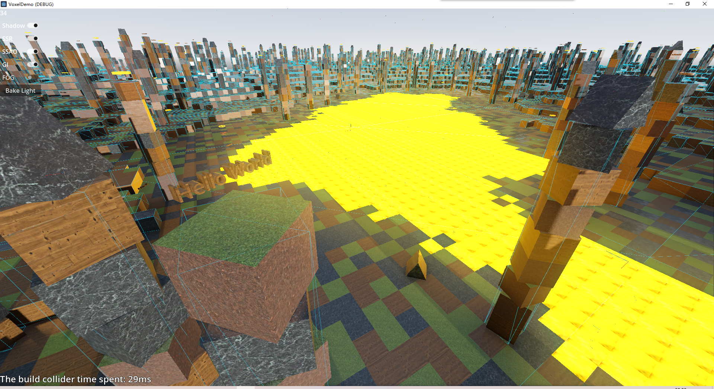
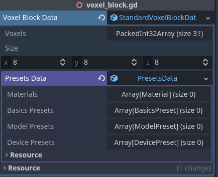
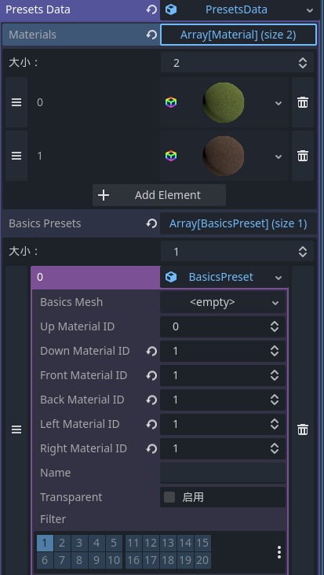
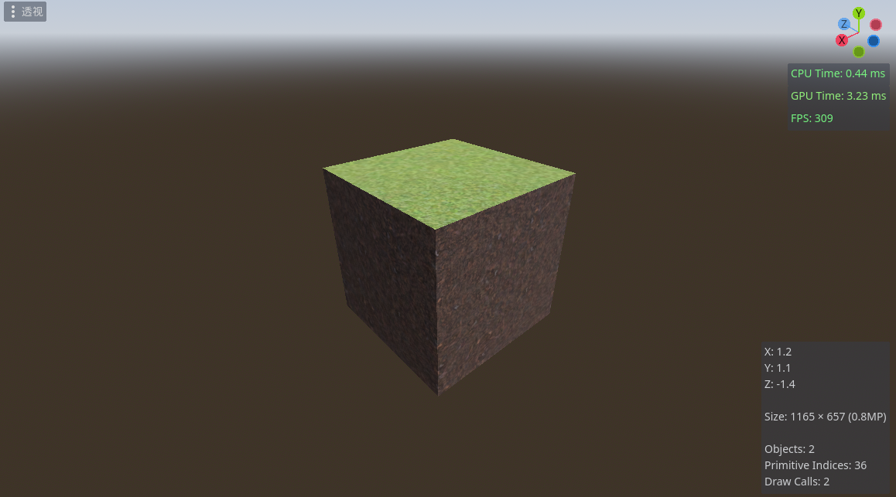
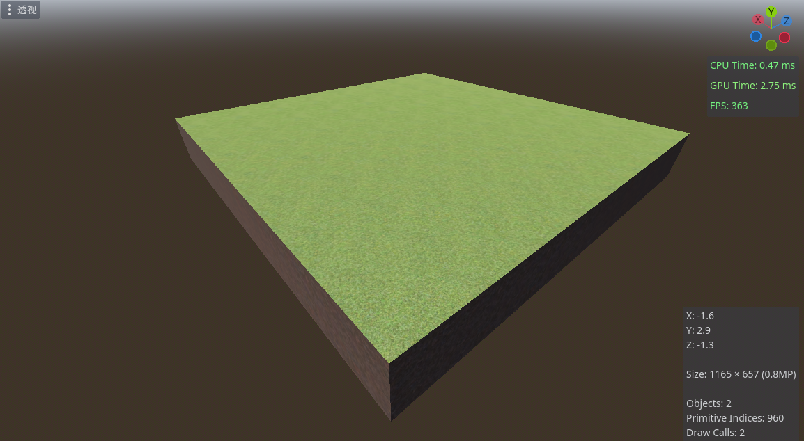
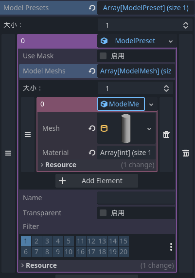
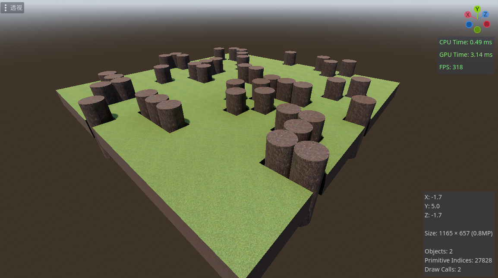

# Godot-VoxelExpansion


[English](./README.md)
[中文](./README_CN.md)

前几个月想到了一个很酷的游戏，可惜项目半途而废了。这个扩展是在设计地图生成时做的，最开始是采用GDScript写的，但是由于性能原因，我决定利用Godot 4.0 GDExpansion使用C++重新编写。注册了一些相关的节点用于生成自定义体素网格，希望可以帮到大家o(\*￣▽￣\*)o



# 如何配置？
在godot项目文件夹下新建一个文件夹并命名为`bin`，将编译好的动态链接库(*.dll)移动到`bin`文件夹内，然后在项目目录中新建一个文件并命名为`voxel.gdextension`
```
[configuration]
entry_symbol = "voxel_library_init"

[libraries]
windows.debug.x86_64 = "res://bin/voxel_expansion.windows.template_debug.x86_64.dll"
windows.release.x86_64 = "res://bin/voxel_expansion.windows.template_release.x86_64.dll"
```
打开编辑器，如果没有输出错误信息就说明大功告成！

# 开始你的第一个体素区块

我们新建一个空场景，在里面添加一个Node3D节点，为节点附加一个脚本，在起始写入

`
@export
var voxel_block_data : StandardVoxelBlockData
`

现在我们可以直接在检查器中编辑体素预设了



| 属性名        | 说明             |
| ------------- | ---------------- |
| Materials     | 材质数组         |
| BasicsPresets | 基础体素预设数组 |
| ModelPresets  | 静态网格预设数组 |
| DevicePresets | 3D结点预设数组   |

现在我想要一个草地方块，我们可以在`materials`属性中添加两个材质，在`basics_presets`属性中添加一个预设


嗯，太好了，我们设置好了`PresetsData`属性，这样`VoxelBlockData`就知道我们需要生成的体素网格是什么样子的(^v^)/

现在在编辑器内在场景中添加一个子节点`MeshInstance3D`用于显示网格

全部代码如下
```godot
@export
var voxel_block_data : StandardVoxelBlockData

func _ready():
	voxel_block_data.set_voxel(Vector3i(0,0,0),voxel_block_data.basics_voxel(0))
	$MeshInstance3D.mesh = voxel_block_data.generate_mesh()
```
嗯嗯嗯，现在我们按`F6`运行当前正在编辑的场景，额，怎么怎么也看不见？啊哦！忘记加摄像机节点了，再加上环境！嗯嗯嗯！看起来还不错o(*￣▽￣*)ブ

ps:这草地贴图有点难看o(TヘTo)

好的，现在这个区块里只有一个孤零零的体素，连个站的位置恐怕都不够
```godot
for x in voxel_block_data.size.x:
	for z in voxel_block_data.size.z:
		voxel_block_data.set_voxel(Vector3i(x,0,z),voxel_block_data.basics_voxel(0))
$MeshInstance3D.mesh = voxel_block_data.generate_mesh()
```


真好o(^▽^)o

现在我突然想加一个圆柱体，额，没原因突然就想怎么做了！！！

在`voxel_block_data`的`model_presets`属性加入


在生成网格之前加上
```godot
	for x in voxel_block_data.size.x:
		for z in voxel_block_data.size.z:
			if(randi() % 6 == 0):
				voxel_block_data.set_voxel(Vector3i(x,0,z),StandardVoxelBlockData.model_voxel(0))
```
好难看啊(ㄒoㄒ)



tip:我偷偷的把`voxel_block_data`的`size`搞大了一点，还有一件事，这个模型顶点数太多了，会拖慢区块加载速度的qwq

# 开始你的第一个体素世界

开摆ing